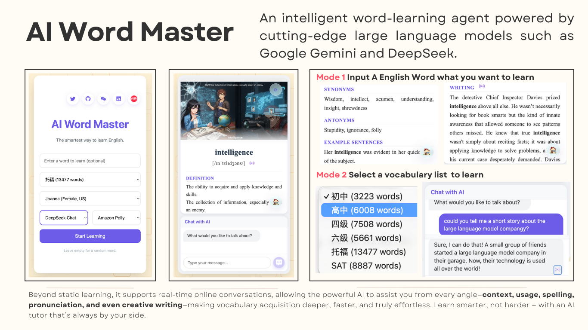

# AI Word Master


[](https://english-word-learn-agent.onrender.com)
[](https://github.com/Cosmoto-jian/English-Word-Learn-Agent)
[](LICENSE.md)
[](#)

**語彙学習をより生き生きと — 任意の単語を入力して、リスニング・スピーキング・リーディング・ライティングを総合的に学習するか、単語リストを選んでランダムに学習してください。**

このプロジェクトは現在開発中です。Google Gemini、DeepSeek、Mistralなどの大規模言語モデルを統合して、単語の定義、例文、ライティングの提案を生成し、Amazon Pollyを使用して自然な発音と会話音声を生成します。今後、リアルタイムの音声→テキスト変換（音声認識）などの機能を追加する予定です。

> **注意:** 初回アクセスは無料枠のコールドスタートにより3〜4分かかる場合があります。

## 機能（Features）

- **語彙レベル**: junior, senior, cet4, cet6, gre, ielts, sat, toefl から選択
- **インタラクティブチャット**: AIチューターと会話練習（多言語入力、英語出力）
- 本システムは複数の大規模言語モデル（Google Gemini、DeepSeek、Mistral）をテキスト生成に利用し、音声合成には Amazon Polly と Deepgram をサポート、さらに Google Gemini Imagen を用いてアニメ風のコンテキスト画像を生成します。

## インストール

### 1. リポジトリをクローン

```bash
git clone <repository-url>
cd AWS-English-academic-presetation
```

### 2. 依存関係のインストール

```bash
pip install -r requirements.txt
```

### 3. 環境変数の設定

プロジェクトルートに `.env` ファイルを作成してください:

```bash
# Text Generation APIs (choose one or more)
MISTRAL_API_KEY=your_mistral_api_key
DEEPSEEK_API_KEY=your_deepseek_api_key
GOOGLE_API_KEY=your_google_api_key

# Google Cloud Configuration for Vertex AI (optional)
GOOGLE_PROJECT_ID=YOUR_PROJECT_ID
GOOGLE_LOCATION=global

# Audio Generation APIs
DEEPGRAM_API_KEY=your_deepgram_api_key

# AWS Configuration (for Amazon Polly)
AWS_PROFILE=EAP001
AWS_REGION=us-east-1

# Server Configuration
PORT=5500
HOST=127.0.0.1
```

### 4. AWS 資格情報の設定（Amazon Polly 用）

`~/.aws/credentials` を作成または編集してください:

```ini
[EAP001]
aws_access_key_id = YOUR_ACCESS_KEY_ID
aws_secret_access_key = YOUR_SECRET_ACCESS_KEY
region = us-east-1
```

**必要な IAM ポリシー**: `AmazonPollyFullAccess`

### 5. アプリを起動

```bash
python server.py
```

またはスタートアップスクリプトを使用:

```bash
./start.sh
```

## 使い方（Usage）

### 単語カードを生成する

1. （任意）ドロップダウンから語彙レベルを選択（junior, senior, cet4, cet6, gre, ielts, sat, toefl）
2. （任意）テキストモデルを選択（Mistral, DeepSeek, Gemini）
3. （任意）音声モデルを選択（Polly または Deepgram）
4. （任意）声を選択（Joanna, Matthew, Salli など）
5. 入力欄に単語を入力（空欄にするとランダム）
6. 「Start Learning」をクリック
7. カード生成を待つ (~15–20 秒)
8. スピーカーアイコンをクリックして音声を再生
9. 発音の IPA 表示の再生ボタンをクリック

### AI とチャットする

1. チャット入力欄にメッセージを入力（任意の言語で可）
2. AI は英語でストリーミング応答を返します
3. スピーカーアイコンをクリックして音声を聴く

### ランダムに新しい単語を取得

右下のリフレッシュボタンをクリックするとランダムな単語カードが生成されます。


## ライセンス

このプロジェクトは教育目的で提供されています。

単語データは [dwyl/english-words](https://github.com/dwyl/english-words) を出典とします。

## 謝辞

- [Mistral AI](https://mistral.ai/) - テキスト生成
- [DeepSeek](https://www.deepseek.com/) - テキスト生成
- [Google Gemini](https://ai.google.dev/) - テキスト・画像生成
- [Amazon Polly](https://aws.amazon.com/polly/) - TTS
- [Deepgram](https://deepgram.com/) - TTS
- [dwyl/english-words](https://github.com/dwyl/english-words) - 単語辞書
